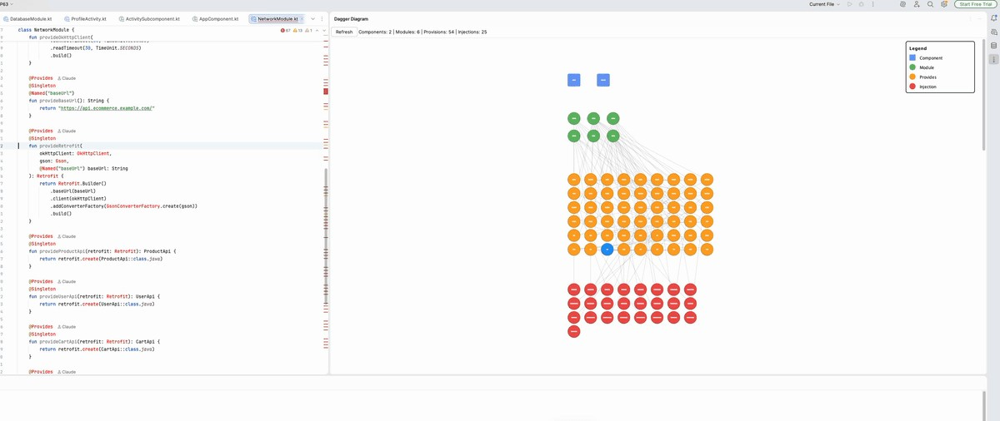

# Dagger Dependency Visualizer

An IntelliJ IDEA plugin that helps developers understand and navigate Dagger 2 dependency injection patterns in Kotlin-based projects.

## Demo



> The plugin renders your entire Dagger graph in a side panel — components, modules, provisions, and injections with color-coded nodes. Hover over any node to highlight its dependency path; click to jump straight to the source.

## Features

- **Interactive Dependency Graph**: Visualize your entire Dagger 2, Hilt, and Anvil dependency injection setup as an interactive graph
- **Hover Path Highlighting**: Hover over any node to trace its full dependency path — upstream providers and downstream consumers light up in orange
- **Clickable Navigation**: Click on any node in the diagram to jump directly to the source code
- **Zoom & Pan**: Scroll to zoom, drag on empty space to pan
- **Gutter Icons**: Inline gutter icons on `@Component`, `@Module`, `@Provides`, `@Inject`, Hilt, and Anvil annotations that open the diagram
- **Comprehensive Analysis**: Identifies all Dagger components, modules, provisions, and injection points
- **Source-only Injections**: Library injections (from JARs) are filtered out — only navigable project-source injections are shown
- **Real-time Updates**: Automatically invalidates cache when source files change

## What It Visualizes

The plugin analyzes and displays:

1. **Components** (shown as squares)
   - `@Component` annotated interfaces
   - Component dependencies and hierarchies
   - Modules included in each component

2. **Modules** (shown as green circles)
   - `@Module` annotated classes
   - Module inclusion relationships
   - All provided dependencies

3. **Provisions** (shown as orange circles)
   - `@Provides` methods
   - `@Binds` methods
   - Constructor injection (`@Inject` constructors)
   - Method parameters and return types
   - Scope and qualifier annotations

4. **Injections** (shown as red circles)
   - `@Inject` annotated fields
   - Constructor parameters
   - Dependency consumers

5. **Relationships** (shown as arrows)
   - Component → Module: Which modules are included in components
   - Module → Module: Module inclusion relationships
   - Module → Provision: Dependencies provided by modules
   - Provision → Provision: Dependencies between provisions
   - Provision → Injection: Where provisions are consumed

## Installation

### Quick Install

1. **Build the plugin** (requires Java 17+ and internet):
   ```bash
   ./gradlew buildPlugin
   ```

2. **Install in IntelliJ IDEA**:
   - Go to `Settings` → `Plugins` → `⚙️` → `Install Plugin from Disk...`
   - Select `build/distributions/dagger-diag-1.0.0.zip`
   - Restart IntelliJ IDEA

**📖 For detailed installation instructions, troubleshooting, and alternative methods, see [INSTALLATION.md](INSTALLATION.md)**

### From JetBrains Marketplace (Coming Soon)

Search for "Dagger Dependency Visualizer" in the IntelliJ IDEA plugins marketplace.

## Usage

### Method 1: Tool Window

1. Open the Dagger Diagram tool window:
   - View → Tool Windows → Dagger Diagram
   - Or click the Dagger icon in the tool window bar (right side)

2. Click the "Analyze Project" button to scan your codebase

3. Interact with the generated diagram:
   - Click on any node to navigate to its source code
   - Hover over nodes to highlight them
   - Scroll to explore large dependency graphs

### Method 2: Keyboard Shortcut

Press `Ctrl+Alt+D` (or `Cmd+Alt+D` on Mac) to:
- Open the Dagger Diagram tool window
- Automatically trigger analysis if not already done

### Method 3: Context Menu

1. Open a Kotlin file containing a `@Component` or `@Module` annotation
2. Right-click in the editor
3. Select "Analyze Dagger Component"

### Method 4: Menu Action

Go to `Tools` → `Show Dagger Diagram`

## Understanding the Diagram

### Node Colors

- **Blue Squares**: Dagger Components
- **Green Circles**: Dagger Modules
- **Orange Circles**: Provision methods (`@Provides`, `@Binds`)
- **Red Circles**: Injection points (`@Inject` fields/constructors)

### Node Labels

Each node displays:
- A type indicator (C=Component, M=Module, P=Provision, I=Injection)
- The name of the class/method/field

### Arrows

Arrows show the flow of dependencies:
- From components to their modules
- From modules to their provisions
- From provisions to their consumers
- Between interconnected provisions

### Legend

A legend in the top-right corner explains the color coding.

## Example Dagger Setup

Here's an example of what the plugin can visualize:

```kotlin
// Component
@Singleton
@Component(modules = [NetworkModule::class, AppModule::class])
interface AppComponent {
    fun inject(activity: MainActivity)
}

// Module
@Module
class NetworkModule {
    @Provides
    @Singleton
    fun provideOkHttpClient(): OkHttpClient {
        return OkHttpClient.Builder().build()
    }

    @Provides
    @Singleton
    fun provideRetrofit(client: OkHttpClient): Retrofit {
        return Retrofit.Builder()
            .client(client)
            .build()
    }
}

// Module
@Module
class AppModule {
    @Provides
    fun provideRepository(retrofit: Retrofit): Repository {
        return RepositoryImpl(retrofit)
    }
}

// Consumer
class MainActivity : AppCompatActivity() {
    @Inject
    lateinit var repository: Repository

    override fun onCreate(savedInstanceState: Bundle?) {
        super.onCreate(savedInstanceState)
        DaggerAppComponent.create().inject(this)
    }
}
```

The plugin will show:
- `AppComponent` connected to `NetworkModule` and `AppModule`
- `NetworkModule` providing `OkHttpClient` and `Retrofit`
- `Retrofit` depending on `OkHttpClient`
- `AppModule` providing `Repository`
- `Repository` depending on `Retrofit`
- `MainActivity` injecting `Repository`

## How It Works

### 1. Code Analysis

The plugin uses IntelliJ's PSI (Program Structure Interface) to:
- Scan all Kotlin files in your project
- Identify Dagger annotations (`@Component`, `@Module`, `@Provides`, `@Inject`, etc.)
- Extract metadata (class names, method signatures, dependencies)

### 2. Graph Building

It constructs a graph data structure where:
- **Nodes** represent Dagger elements (components, modules, provisions, injections)
- **Edges** represent relationships (dependencies, inclusions, consumption)

### 3. Layout Algorithm

A hierarchical layout algorithm positions nodes:
- Components at the top
- Modules in the middle-upper layer
- Provisions in the middle-lower layer
- Injections at the bottom

This creates a top-down flow showing how dependencies are provided and consumed.

### 4. Visualization

A custom Swing panel renders:
- Nodes as shapes (squares for components, circles for others)
- Edges as arrows
- Interactive hover and click handlers

### 5. Navigation

When you click a node:
- The plugin retrieves the PSI element's file path and line number
- Opens the file in the editor
- (Future enhancement: scrolls to the exact line)

## Supported Dagger Annotations

- `@Component`
- `@Subcomponent`
- `@Module`
- `@Provides`
- `@Binds`
- `@Inject`
- `@Singleton` (and other scope annotations)
- `@Named` (and other qualifier annotations)

## Requirements

- IntelliJ IDEA 2024.2 or later (including 2025.x versions)
- Kotlin plugin enabled
- Project using Dagger 2

## Performance

- Analysis runs asynchronously in a background thread
- Results are cached until files change
- Large projects (1000+ files) may take 10-30 seconds to analyze

## Troubleshooting

### "No Dagger components or modules found"

Make sure your project:
- Uses Dagger 2 annotations
- Has Kotlin files with `@Component` or `@Module` annotations
- Has properly configured Dagger dependencies in Gradle

### Diagram is too large

- Use the scroll bars to navigate
- Future versions will include zoom and filtering options

### Plugin crashes or freezes

- Check the IntelliJ logs: `Help` → `Show Log in Finder/Explorer`
- Report issues on GitHub with the error log

## Future Enhancements

- [ ] Filter nodes by scope or module
- [ ] Search functionality
- [ ] Export diagram as image/SVG
- [ ] Show dependency cycles and potential issues
- [ ] Multi-module project support
- [ ] Java support (currently Kotlin-only)

## Contributing

Contributions are welcome! Please:

1. Fork the repository
2. Create a feature branch
3. Make your changes
4. Add tests if applicable
5. Submit a pull request

## License

This project is licensed under the MIT License - see the LICENSE file for details.

## Credits

Developed with ❤️ for the Android and Kotlin community.

## Support

- GitHub Issues: [Report a bug](https://github.com/yourusername/dagger-diag-plugin/issues)
- Discussions: [Ask questions](https://github.com/yourusername/dagger-diag-plugin/discussions)

## Related Projects

- [Dagger 2](https://dagger.dev/)
- [IntelliJ Platform SDK](https://plugins.jetbrains.com/docs/intellij/)
- [Kotlin](https://kotlinlang.org/)
